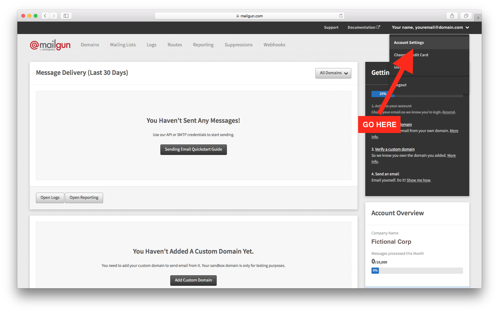

# How to send emails with Keystone

We often had to send emails in our Keystone projects, so we figured we
might as well make that easier. With the standalone
[`keystone-email`](http://npm.im/keystone-email) package, containing Mailgun
and Mandrill integrations, you'll be sending emails in less than 5
minutes!

## Setup

1. Install the `keystone-email package` in your project with

```sh
npm install keystone-email --save
```

That's everything there is to it from the Keystone side!

You will need a [Mailgun](https://mailgun.com) account to be able to
send emails though. (Mailgun gives you 10000 emails/month for free!)
Let's create that:

1. Sign up on [mailgun.com](https://mailgun.com)
2. When you've created the account you should see a message saying
   "You're signed up and we just created your sandbox server
   xyz.mailgun.org". **Copy the link to your sandbox to a safe place**,
   we'll use it soon!
3. Click on "authorized recipients" on that page and invite yourself
   with your own email as an authorized recipient 
4. Activate your account and agree to be an authorized recipient in the
   two emails Mailgun sent you
5. Go to your dashboard, click on your name in the top right corner and
   show and **copy your private API key** and store it next to the
   sandbox URL, we'll need that too!



> Note: You can also use Mandrill with `keystone-email`, but since it
> has no free tier we'll skip it for this guide, see the
> [`keystone-email`](http://npm.im/keystone-email) docs for more
> information!

Now we're all setup to start sending emails!

## Sending your first email

For exemplary purposes, create a `test-email.js` file in the root of
your project and require `keystone-email`:

```javascript
// test-email.js
var Email = require('keystone-email');
```

`keystone-email` uses templates. You can use whatever templating engine
you prefer (set it via the `engine` option) but for this guide we'll be
using `pug`! (formerly called `jade`)

Create another file in the root folder called `test-email.pug` and fill
it with this content:

```jade
<!-- test-email.pug -->

doctype html
html(lang="en")
  head
  body
    h1 Your first email sent with Keystone!
    p Congratulations on sending your first email with Keystone
```

Nothing fancy, a simple heading and paragraph for now.

Let's swap back to our `test-email.js` file and tell `keystone-email`
which template we want to use. We pass that in as the first argument to
`new Email()`:

```javascript
// test-email.js
var Email = require('keystone-email');

new Email('test-email.pug', {});
```

In the second argument, the email options, we tell it we want to use
Mailgun as the email transport mechanism by setting `transport` to
`mailgun` (surprisingly!):

```javascript
// test-email.js
var Email = require('keystone-email');

new Email('test-email.pug', {
  transport: 'mailgun',
});
```

This won't actually `send` the email though! (how should it, we haven't
told Keystone where to send the email to yet!)

When called, `Email` returns a `send` function that you can use to
actually send an email with the specified template. It takes three
arguments: the `locals` (the data that goes into the template), the
`senderOptions` (where to send the email to/from, the subject, the
mailgun options,...) and as the last argument a callback.

Since we don't have any data in our template yet, we'll simply set the
`locals` to an empty object:

```javascript
// test-email.js
var Email = require('keystone-email');

new Email('test-email.pug', {
  transport: 'mailgun',
}).send({});
```

The `senderOptions` are the meat of this function call. We need to tell
`keystone-email` where to send the email `to`, where it should pretend
to come `from`, what the `subject` is and finally the Mailgun API
details and sandbox url:

```javascript
// test-email.js
var Email = require('keystone-email');

new Email('test-email.pug', {
  transport: 'mailgun',
}).send({}, {
  apiKey: 'YOURAPIKEYHERE',
  domain: 'sandox123asdf234YOURSANDBOX.mailgun.com',
  to: 'yourauthorizedrecipient@email.here',
  from: {
    name: 'Your Site',
    email: 'hello@yoursite.com',
  },
  subject: 'Your first KeystoneJS email',
});
```

If you tried to run this, it would already work! 🎉 Let's add a callback
though, to make sure we get errors logged if something goes wrong or a
message logged if it goes right:

```javascript
// test-email.js
var Email = require('keystone-email');

new Email('test-email.pug', {
  transport: 'mailgun',
}).send({}, {
  apiKey: 'YOURAPIKEYHERE',
  domain: 'sandox123asdf234YOURSANDBOX.mailgun.com',
  to: 'yourauthorizedrecipient@email.here',
  from: {
    name: 'Your Site',
    email: 'hello@yoursite.com',
  },
  subject: 'Your first KeystoneJS email',
}, function (err, result) {
  if (err) {
    console.error('🤕 Mailgun test failed with error:\n', err);
  } else {
    console.log('📬 Successfully sent Mailgun test with result:\n', result);
  }
});
```

Now run this file with `node test-email.js`, and you should see this
logged in your console:

```javascript
📬 Successfully sent Mailgun test with result
 { id: '<somelongid@sandboxsomestuffhere.mailgun.org>',
  message: 'Queued. Thank you.'
```

Go check your inbox! Congratulations, you just sent your first email
with `keystone-email`!

## Inserting locals

In a real world scenario you will almost always want to pass data into
your templates, for example to say hi to your users by name. Let's do
exactly that!

First, adapt your template to accept data. In Pug you use locals
with the `#{ recipient.variable }` syntax. Change `test-email.pug` to have this
content:

```jade
<!-- test-email.pug -->

doctype html
html(lang="en")
  head
  body
    h1 Hi %recipient.firstName% this is your second email sent with Keystone!
    p This is your full name: %recipient.firstName% %recipient.name%
```

As you can see above, we need to pass `firstName` and `name` to our
template via the locals option. Go back to `test-email.js` and take a
look at the `Email(...).send()` call we do:

```javascript
new Email(/* ... */).send({}, {/* ... */}, function (err, result) {/* ... */});
```

See that empty first argument? Specify your first name and your last
name in there like so:

```javascript
new Email(/* ... */).send({
  firstName: 'Max',
  name: 'Stoiber',
}, {/* ... */}, function (err, result) {/* ... */});
```

Now send another email with `node test-email.js`! This is the text you
should see once you've received it:

```sh
Hi Max, this is your second email sent with Keystone!

Let's hope that this is your first and last name: Max Stoiber
```

(replacing `Max` and `Stoiber` with your first and last names
respectively)

Amazing, that wasn't too hard, huh? We've successfully sent a
personalized email!

Now go ahead and add emails to your app!
